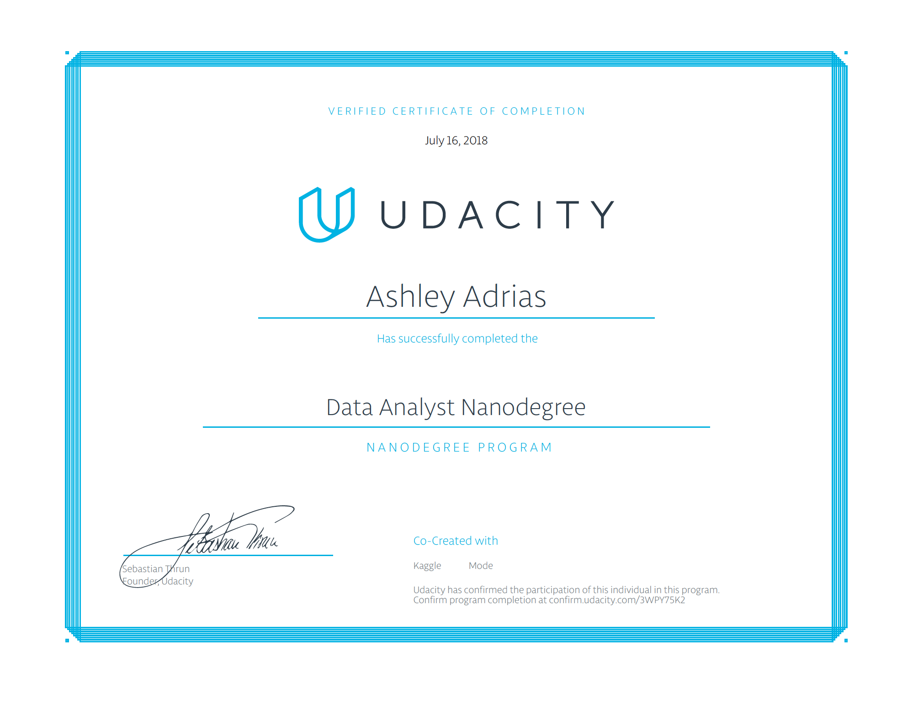

# [Udacity Data Analyst Nanodegree](https://www.udacity.com/course/data-analyst-nanodegree--nd002)
Projects for my Udacity Data Analyst Nanodegree

### Term 1

### P1: Explore Weather Trends

In this project, you will analyze local and global temperature data and compare the temperature trends where you live to overall global temperature trends.

### P2: Explore US Bikeshare Data

I make use of Python to explore data related to bikeshare systems for three major bikeshare systems in the United States. I perform data wrangling to unify the format of data from the three systems and write code to compute descriptive statistics. 

### P3: Investigate a Dataset

In this project, I analyze a dataset and then communicate my findings about it. I use the Python libraries NumPy, pandas, and Matplotlib to make my analysis easier.

### P4: Analyze A/B Test Results

I explore the results of an A/B test run by an e-commerce website. The company has developed a new web page in order to try and increase the number of users who "convert," meaning the number of users who decide to pay for the company's product. My goal is to work through this notebook to help the company understand if they should implement this new page, keep the old page, or perhaps run the experiment longer to make their decision.

### Term 2

### P5: Test a Perceptual Phenomenon

I investigate a classic phenomenon from experimental psychology called the Stroop Effect. I learn a little bit about the experiment, create a hypothesis regarding the outcome of the task, then go through the task. I then look at some data collected from others who have performed the same task and will compute some statistics describing the results. Finally, I interpret the results in terms of your hypotheses.

### P6: Explore and Summarize Data

I use R and apply exploratory data analysis techniques to explore relationships in one variable to multiple variables and to explore a selected data set for distributions, outliers, and anomalies.

### P7: Wrangle and Analyze Data

Real-world data rarely comes clean. Using Python and its libraries, I gather data from a variety of sources and in a variety of formats, assess its quality and tidiness, then clean it. This is called data wrangling. I document your wrangling efforts in a Jupyter Notebook, plus showcase them through analyses and visualizations using Python (and its libraries) and/or SQL.

### P8: Create Tableau Story

I create a data visualization using Tableau that tells a story or highlights trends or patterns in a data set. My work should be a reflection of the theory and practice of data visualization, such as visual encodings, design principles, and effective communication.

[Udacity Data Analyst Nanodegree certificate](certificate.pdf) Data-Analyst-Nanodegree-Program

